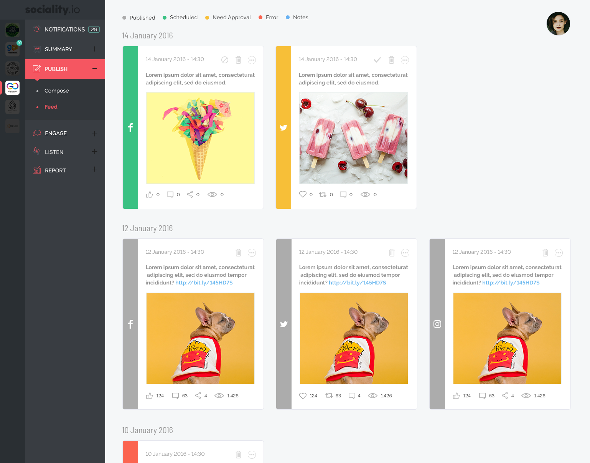

# Sociality Case


## Project Design


Hi, I write this project for sociality frontend developer position. I hope you like it.

If you wanna test this app live, go check this link below; <br>
[Live Demo](https://sociality-case.netlify.app/)


### Install project dependencies with;
```bash
    yarn  && npm install 
```
### Start project with;
```bash
    yarn start && npm run dev
```

